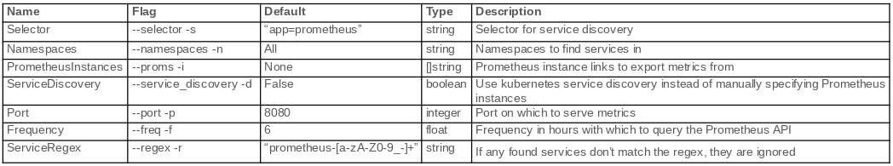

# Prometheus Cardinality Exporter

A simple Prometheus exporter for exposing the cadinality of metrics Prometheus has scraped.

## Design

This is a simple Golang webserver which exposes a single endpoint, `/metrics`.

## Metrics

There are 4 types of metric exposed:

```
1. cardinality_exporter_label_value_count_by_label_name{label=""}: These metrics report label names and their respective value counts.
2. cardinality_exporter_memory_in_bytes_by_label_name{label=""}: These metrics report label names and their respective memory used in bytes. Memory usage is calculated by adding the length of all values for a given label name.
3. cardinality_exporter_series_count_by_label_pair{label_pair=""}: This will provide a list of label value pairs and their series count.
4. cardinality_exporter_series_count_by_metric_name{metric=""}: These metrics report metric names and their respective series counts.
```
## Options



## Exposing Metrics

### Running Locally
```plz run //:prometheus-cardinality-exporter --port=<port-to-serve-on> --proms=<prometheus-instance-to-expose> [--proms=<prometheus-instance-to-expose>...] --freq=<frequency-to-ping-api>```

### Running Within a Kubernetes Cluster (with service discovery)
```plz run //:prometheus-cardinality-exporter --port=<port-to-serve-on> --service_discovery --freq=<frequency-to-ping-api> --selector=<service-selector> --regex=<regex-for-prometheus-instances> --namespaces=<namespace-of-prometheus-instances> [--namespaces=<namespace-of-prometheus-instances>...]```
